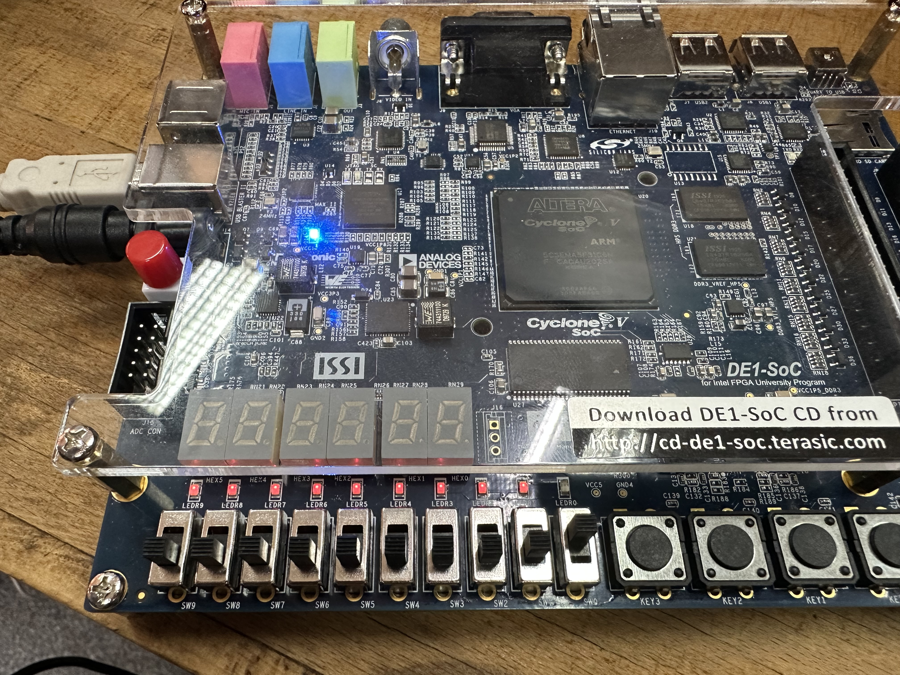

# AES Encryption and Decryption with SPI

This project showcases the implementation of AES encryption and decryption using Verilog. The goal is to design a circuit that can securely encrypt and decrypt data following the Advanced Encryption Standard (AES) algorithm. The project also incorporates a Serial Peripheral Interface (SPI) for data communication.

## Description

AES is a widely used encryption algorithm that operates on 128-bit blocks and supports key sizes of 128, 192, and 256 bits. In this project, I have implemented AES encryption and decryption modules that are capable of handling all three key sizes.

To facilitate data transfer and integration with other systems, the encryption and decryption modules are designed with a serial interface following the SPI specification. The SPI interface enables the modules to receive input data and keys bit-by-bit over multiple clock cycles and deliver the encrypted or decrypted data in a similar manner. The SPI mode 0, which is widely adopted, is used in this project.

The project includes a comprehensive testbench that verifies the functionality of the encryption and decryption modules. The testbench utilizes multiple test cases with different messages and keys to ensure the correct operation of the modules across various scenarios. It provides self-checking capabilities and reports the number of successful and failed test cases.

Additionally, a test wrapper is implemented to facilitate testing on the DE1-SoC board. The test wrapper drives the inputs of the encryption and decryption modules and indicates the test results through an LED. This allows for easy verification of the modules' performance in a hardware environment.

## Real Time testing on Hardware

Image when the reset switch is high where the led turns off because no encryption - decryption process occurring, only reset.

Image when the reset switch is low where the led turns on because of successful encryption - decryption process.

## How to run
to run the simulation through terminal make sure you have modelsim software installed and type the following in terminal
```
vlib work //to create a library (only first time)
vlog *.v
vsim "file want to simulate".v
```
## 👨‍💻 **Contributors**

1. [Salah Abotaleb](https://github.com/SalahAbotaleb)
2. [Hussein Elhawary](https://github.com/Hussein-Elhawary)
3. [Omar Elzahar](https://github.com/omarelzahar02)

